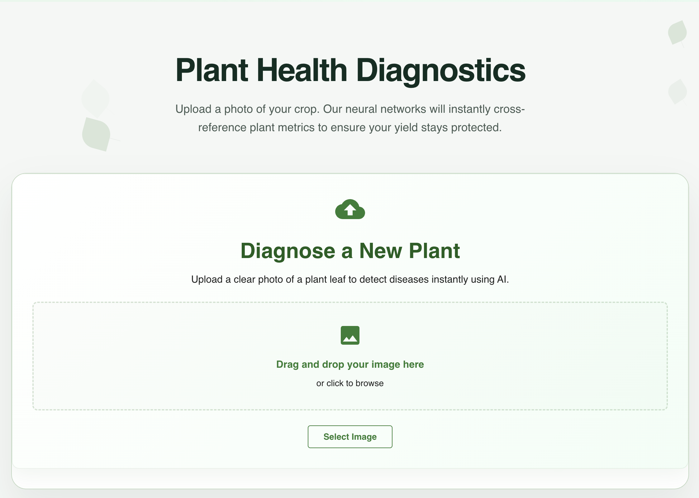
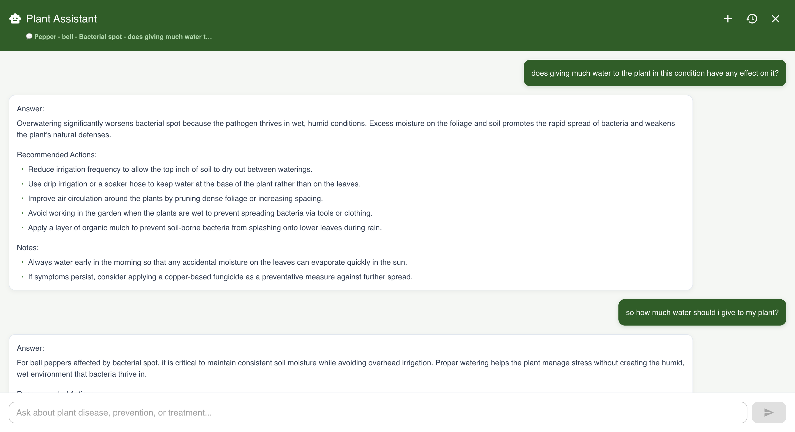
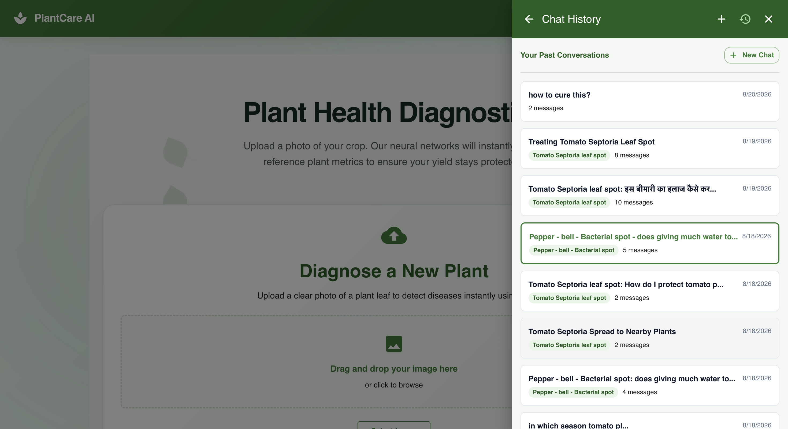
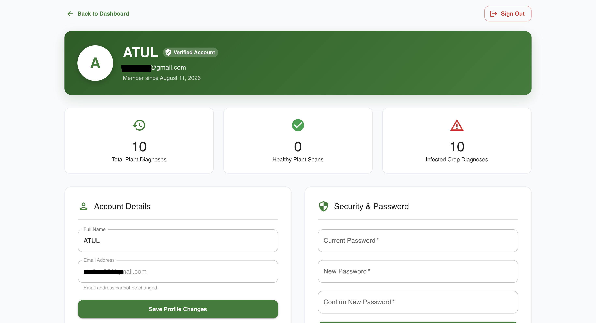
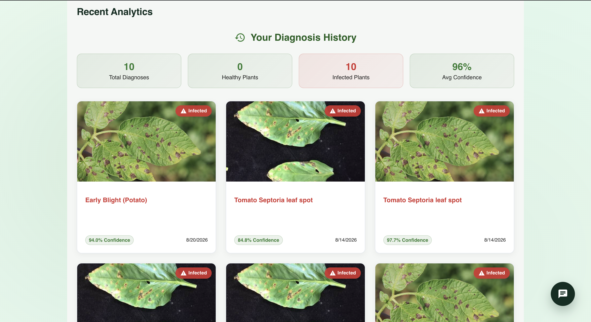

<a id="readme-top"></a>

<div align="center">

[](https://github.com/Anirudhsingh2479/Plant_Disease_Detection/graphs/contributors)&nbsp;[](https://github.com/Anirudhsingh2479/Plant_Disease_Detection/network/members)&nbsp;[](https://github.com/Anirudhsingh2479/Plant_Disease_Detection/stargazers)&nbsp;[](https://github.com/Anirudhsingh2479/Plant_Disease_Detection/issues)&nbsp;[](https://github.com/Anirudhsingh2479/Plant_Disease_Detection/blob/main/LICENSE)&nbsp;[](https://predict-plant-disease-client.onrender.com/dashboard)&nbsp;

</div>
<br />
<div align="center">
  <a href="https://github.com/Anirudhsingh2479/Plant_Disease_Detection">
    
  </a>

<h3 align="center">KrishiMitra - Plant Disease Detection & AI Agronomist Platform © 2026</h3>
  <p align="center">
    An AI-powered full-stack platform for instant plant disease diagnosis, RAG-based smart agronomist assistance, and crop health tracking.
    <br /><br />
    <a href="https://predict-plant-disease-client.onrender.com/dashboard"><strong>🌐 Live Demo Dashboard »</strong></a>
    &nbsp;·&nbsp;
    <a href="#-video-demo"><strong>Watch Video Demo »</strong></a>
    <br />
    <a href="https://github.com/Anirudhsingh2479/Plant_Disease_Detection/issues">Report Bug</a>
    ·
    <a href="https://github.com/Anirudhsingh2479/Plant_Disease_Detection/issues">Request Feature</a>
  </p>
</div>

<details class="toc">
  <summary>Table of Contents</summary>
  <ol>
    <li>
      <a href="#about-the-project">About The Project</a>
      <ul>
        <li><a href="#built-with">Built With</a></li>
      </ul>
    </li>
    <li><a href="#-key-features">Key Features</a></li>
    <li>
      <a href="#-screenshots--demo">Screenshots & Demo</a>
      <ul>
        <li><a href="#-live-demo">Live Demo</a></li>
        <li><a href="#screenshots">Screenshots</a></li>
        <li><a href="#-video-demo">Video Demo</a></li>
      </ul>
    </li>
    <li>
      <a href="#getting-started">Getting Started</a>
      <ul>
        <li><a href="#prerequisites">Prerequisites</a></li>
        <li><a href="#installation--setup">Installation & Setup</a></li>
      </ul>
    </li>
    <li><a href="#system-architecture--flow">System Architecture & Flow</a></li>
    <li><a href="#usage">Usage</a></li>
    <li><a href="#contributing">Contributing</a></li>
    <li><a href="#license">License</a></li>
    <li><a href="#contact">Contact</a></li>
    <li><a href="#acknowledgments">Acknowledgments</a></li>
  </ol>
</details>

---

> 🌐 **Live Application**: The platform is live and running at **[predict-plant-disease-client.onrender.com/dashboard](https://predict-plant-disease-client.onrender.com/dashboard)**.

## About The Project

**AgriVision (Plant Disease Detection Platform)** is an intelligent agricultural solution designed to help farmers, gardeners, and agronomists instantly identify crop diseases, receive actionable treatment recommendations, and converse with an AI Agronomist Assistant.

Built with a decoupled microservice architecture:
1. **React Frontend**: An interactive dashboard with real-time SSE chat streaming, dynamic disease record management, and responsive Material-UI design.
2. **Node.js/Express Server**: Secure API gateway providing JWT authentication, MongoDB data storage, image upload processing, and service orchestration.
3. **FastAPI ML & AI Service**: High-performance Python microservice powering TensorFlow CNN inference for leaf image classification and LangChain + Chroma Vector DB + Google Gemini for Retrieval-Augmented Generation (RAG) plant care assistance.

---

### Built With

This project leverages modern technologies across full-stack web development and artificial intelligence.

**Frontend:**
* [![React][React.js]][React-url] - Core UI framework (v19)
* [](https://mui.com/) - UI component library
* [](https://redux-toolkit.js.org/) - Global state management
* [](https://vitejs.dev/) - Lightning-fast build tool
* **Framer Motion** - Fluid UI animations & transitions
* **i18next** - Multilingual internationalization support
* **Axios & React Router v7** - Routing and API integration

**Backend Server:**
* [![Node][Node.js]][Node-url] - JavaScript runtime environment
* [![Express][Express.js]][Express-url] - API web framework (v5)
* [![MongoDB][MongoDB]][Mongo-url] - NoSQL database for disease records & users
* **Mongoose** - Object Data Modeling (ODM)
* **JWT & Bcrypt** - Authentication and security
* **Zod** - Runtime request validation
* **Cloudinary** - Image upload and storage cloud

**AI & ML Microservice:**
* [](https://fastapi.tiangolo.com/) - High-performance Python API framework
* [](https://www.tensorflow.org/) - CNN leaf disease classification model
* [](https://python.org/) - Python 3.11/3.12 runtime
* **LangChain & ChromaDB** - Vector embeddings and RAG pipeline
* **Google Gemini API** - LLM response generation
* **Uvicorn** - ASGI server implementation

<p align="right">(<a href="#readme-top">back to top</a>)</p>

---

## ✨ Key Features

### 🌿 **AI Plant Disease Diagnosis**
* **Instant Image Analysis**: Upload plant leaf images via camera or file selector.
* **Robust Multi-Crop Inference**: Uses multi-crop + horizontal flip averaging CNN model to improve real-world field photo accuracy.
* **Detailed Diagnostics**: Receive predicted disease name, confidence score, description, biological causes, and recommended treatment protocols.

### 🤖 **RAG AI Agronomist Chatbot**
* **Context-Aware Assistance**: Ask questions about plant health, soil conditions, pesticides, and prevention strategies.
* **Retrieval-Augmented Generation (RAG)**: Queries local vector embeddings (Chroma DB) created with `sentence-transformers` for verified agricultural domain knowledge.
* **Real-Time Streaming**: Supports Server-Sent Events (SSE) streaming for fast, token-by-token response rendering.
* **Multilingual Support**: Supports queries and answers in multiple languages.

### 📜 **Diagnosis History & Management**
* **Historical Records**: Store and track past disease diagnoses attached to user accounts.
* **Filtering & Search**: Search past diagnoses by crop name, disease type, or date.
* **Image Archival**: Cloudinary integration for durable leaf image storage.

### 🔐 **Security & Infrastructure**
* **JWT Authentication**: Access and refresh tokens with HTTP-only cookie support.
* **Input Validation & Sanitization**: Zod validation schemas and MongoDB query injection protection (`express-mongo-sanitize`).
* **Rate Limiting & Security Headers**: Protection against brute-force attacks via `express-rate-limit` and `helmet`.

<p align="right">(<a href="#readme-top">back to top</a>)</p>

---

## 📸 Screenshots & Demo

### 🌐 Live Demo
Experience KrishiMitra live directly in your browser:
* **Deployed Web Application**: [https://predict-plant-disease-client.onrender.com/dashboard](https://predict-plant-disease-client.onrender.com/dashboard)

---

### Screenshots

<div align="center">

#### 🌿 Diagnosis & Upload Dashboard
*Upload leaf images and receive instant CNN predictions with treatments*



#### 🤖 AI Agronomist Chatbot
*Interactive RAG chatbot powered by Gemini API, LangChain, and ChromaDB*



#### 📜 History & Records
*Track previous plant diagnoses and treatment progress over time*



#### 👤 User Profile & Settings
*Manage user profile, preferences, and account credentials*



#### ⚡ FastAPI Service Status
*Health monitoring and inference microservice endpoint dashboard*



</div>

### 🎥 Video Demo

https://github.com/Anirudhsingh2479/Plant_Disease_Detection/raw/main/assets/demo_video.mp4

<p align="right">(<a href="#readme-top">back to top</a>)</p>

---

## Getting Started

Follow these steps to set up AgriVision locally for development and testing.

### Prerequisites

Ensure you have the following installed on your environment:

* **Node.js** (v18.x or later) - [Download here](https://nodejs.org/)
* **Python** (v3.11 or v3.12) - Required for TensorFlow & LangChain dependencies
* **MongoDB** - Local instance or [MongoDB Atlas](https://www.mongodb.com/cloud/atlas) connection
* **Google Gemini API Key** - [Get key from Google AI Studio](https://aistudio.google.com/)

---

### Installation & Setup

#### 1. Clone the Repository
```sh
git clone https://github.com/Anirudhsingh2479/Plant_Disease_Detection.git
cd Plant_Disease_Detection
```

#### 2. FastAPI Inference Service Setup

Navigate to the `fastapi_service` directory:
```sh
cd fastapi_service
```

Create and activate a Python virtual environment:
```sh
# On macOS/Linux:
python3.11 -m venv .venv
source .venv/bin/activate

# On Windows:
python -m venv .venv
.venv\Scripts\activate
```

Install dependencies:
```sh
pip install -r requirements.txt
```

Create a `.env` file in `fastapi_service/`:
```env
# Path to your trained TensorFlow Keras model (.keras or .h5)
MODEL_PATH="/path/to/your/best_plant_model.keras"

# Google Gemini API key for RAG Chatbot
GOOGLE_API_KEY="your_google_gemini_api_key"

# Optional parameters:
LABELS_PATH="./labels.json"
IMAGE_SIZE="256"
CHATBOT_KNOWLEDGE_PATH="./plant_disease.txt"
CHATBOT_CHROMA_PATH="./chroma_db"
CHATBOT_EMBEDDING_MODEL="sentence-transformers/all-mpnet-base-v2"
CHATBOT_WARMUP="true"
```

Start the FastAPI microservice:
```sh
uvicorn app.main:app --host 0.0.0.0 --port 8000 --reload
```
The FastAPI documentation will be available at `http://localhost:8000/docs`

---

#### 3. Backend Express Server Setup

In a new terminal window, navigate to `server/`:
```sh
cd server
npm install
```

Create a `.env` file in `server/`:
```env
PORT=5000
NODE_ENV=development

# Database
MONGODB_URI=mongodb://localhost:27017/plant_disease_db

# Security & Auth
ACCESS_JWT_TOKEN_SECRET=your_super_secret_access_token_min_32_chars
REFRESH_JWT_TOKEN_SECRET=your_super_secret_refresh_token_min_32_chars
ACCESS_JWT_TOKEN_EXPIRY=15m
REFRESH_JWT_TOKEN_EXPIRY=7d

# Microservice URL (FastAPI)
FASTAPI_URL=http://127.0.0.1:8000
FASTAPI_TIMEOUT_MS=15000

# Cloudinary (Image storage)
CLOUDINARY_CLOUD_NAME=your_cloudinary_cloud_name
CLOUDINARY_API_KEY=your_cloudinary_api_key
CLOUDINARY_API_SECRET=your_cloudinary_api_secret

# Email (Nodemailer - Optional for reset password/verification)
SMTP_HOST=smtp.gmail.com
SMTP_PORT=587
SMTP_USER=your_email@gmail.com
SMTP_PASS=your_app_password
```

Start the Node backend server:
```sh
npm run dev
```
The server API will start at `http://localhost:5000`

---

#### 4. Frontend React Setup

In a third terminal window, navigate to `client/`:
```sh
cd client
npm install
```

Create a `.env` file in `client/`:
```env
VITE_API_BASE_URL=http://localhost:5000/api
```

Start the React development server:
```sh
npm run dev
```
The client application will be accessible at `http://localhost:5173`

<p align="right">(<a href="#readme-top">back to top</a>)</p>

---

## System Architecture & Flow

```
+------------------+         HTTP Multipart         +------------------+
|                  | -----------------------------> |                  |
|  React 19 Client |                                | Node.js Express  |
|   (Vite + MUI)   | <----------------------------- |      Server      |
+------------------+          JSON Response         +------------------+
         |                                                   |
         | SSE Chat Stream                                   | Image Forward
         v                                                   v
+----------------------------------------------------------------------+
|                         FastAPI Service                              |
|  +---------------------------+    +-------------------------------+  |
|  |  TensorFlow CNN Model     |    |  RAG Chatbot Pipeline         |  |
|  | (Multi-crop classification)|    | (ChromaDB + Gemini + LangChain)|  |
|  +---------------------------+    +-------------------------------+  |
+----------------------------------------------------------------------+
```

<p align="right">(<a href="#readme-top">back to top</a>)</p>

---

## Usage

### 🌿 Disease Diagnosis Workflow
1. Log in to your AgriVision account.
2. Navigate to the **Diagnosis** tab.
3. Drag & drop or upload a photo of an affected plant leaf.
4. Click **Analyze Leaf Image**.
5. View the detected disease, model confidence, biological explanation, and recommended chemical/organic treatment protocols.

### 🤖 AI Agronomist Chatbot
1. Click on the **AI Assistant** icon.
2. Ask questions such as *"How do I treat early blight in tomatoes?"* or *"What fertilizer should I use after leaf spot recovery?"*.
3. Experience instant, streaming responses enriched by domain knowledge retrieved via ChromaDB.

<p align="right">(<a href="#readme-top">back to top</a>)</p>

---

## 🤝 Contributing

Contributions are what make the open-source community an incredible place to learn, inspire, and create. Any contributions you make are **greatly appreciated**!

1. Fork the Project
2. Create your Feature Branch (`git checkout -b feature/AmazingFeature`)
3. Commit your Changes (`git commit -m 'Add some AmazingFeature'`)
4. Push to the Branch (`git push origin feature/AmazingFeature`)
5. Open a Pull Request

<p align="right">(<a href="#readme-top">back to top</a>)</p>

---

## 📄 License

Distributed under the MIT License. See `LICENSE` for more information.

<p align="right">(<a href="#readme-top">back to top</a>)</p>

---

## 📧 Contact

**Project Maintainer:** Anirudh Singh

**Project Link:** [https://github.com/Anirudhsingh2479/Plant_Disease_Detection](https://github.com/Anirudhsingh2479/Plant_Disease_Detection)

<p align="right">(<a href="#readme-top">back to top</a>)</p>

---

## 🙏 Acknowledgments

* [PlantVillage Dataset](https://github.com/spMohanty/PlantVillage-Dataset) - For plant disease research images
* [TensorFlow](https://www.tensorflow.org/) - Deep learning framework
* [LangChain](https://www.langchain.com/) - LLM application framework
* [Google Gemini API](https://ai.google.dev/) - AI response engine
* [Material-UI](https://mui.com/) - React UI design components

---

<div align="center">

**Made with ❤️ for better crop health & sustainable agriculture**

</div>

[React.js]: https://img.shields.io/badge/React-20232A?style=for-the-badge&logo=react&logoColor=61DAFB
[React-url]: https://reactjs.org/
[Node.js]: https://img.shields.io/badge/Node.js-339933?style=for-the-badge&logo=react&logoColor=white
[Node-url]: https://nodejs.org/
[Express.js]: https://img.shields.io/badge/Express.js-000000?style=for-the-badge&logo=express&logoColor=white
[Express-url]: https://expressjs.com/
[MongoDB]: https://img.shields.io/badge/MongoDB-47A248?style=for-the-badge&logo=mongodb&logoColor=white
[Mongo-url]: https://www.mongodb.com/
